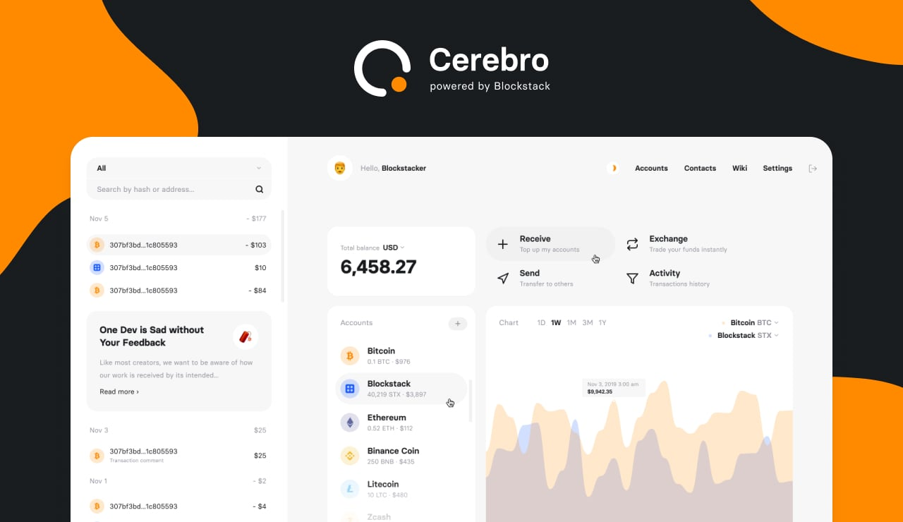

[Cerebro](https://cerebrowallet.com) is an open source multicurrency wallet powered by [Blockstack](https:blockstack.org). The wallet is browser-based and adaptive interface that uses public data from blockchain and explorer APIs.

It uses Gaia decentralized storage and encryption option. Cerebro doesn't store or proceed user private key, the all data are securely stored in the Gaia by Blockstack.

## Getting Started

Add steps

## Supported Blockchains (Coins)

We started with Bitcoin and we plan to add other currencies after testing the beta version of the wallet. Get your favorite coin added to Cerebro: [Suggest a coin](https://github.com/cerebrowallet/cerebro-website/issues/new/choose)

## Reporting bugs

The best way to submit feedback and report bugs is to [create issue](https://github.com/cerebrowallet/cerebro-website/issues/new/choose). And of course you can send mail to [support@cerebrowallet.com](mailto:support@cerebrowallet.com)

## License

Cerebro Wallet is available under the MIT license. See the [LICENSE](https://github.com/cerebrowallet/cerebro-wallet/blob/master/LICENSE) file for more info.
